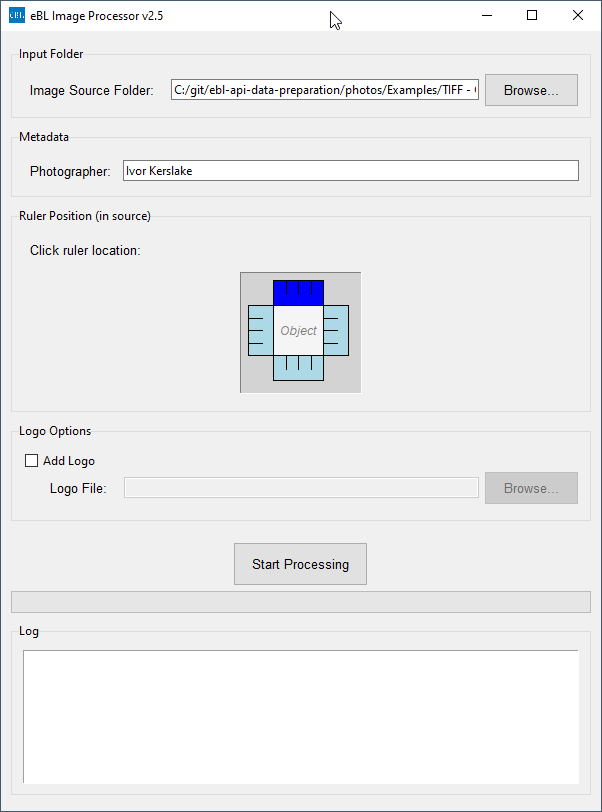
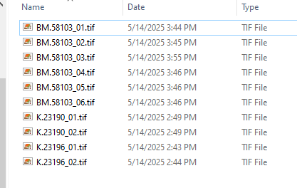

# eBL Image Processor

## Table of Contents

- [Overview](#overview)
- [Features](#features)
- [File Structure Overview](#file-structure-overview)
- [Prerequisites](#prerequisites)
- [Setup](#setup)
- [Usage (Python)](#usage-python)
- [Usage (GUI)](#usage-gui)
- [Configuration](#configuration)
- [Packaging (Optional)](#packaging-optional)

## Overview

The eBL Image Processor is a Python-based application designed to automate a multi-step workflow for processing sets of archaeological or cuneiform tablet images. It includes features for RAW image conversion, object extraction, ruler scale detection, digital ruler generation, image stitching, metadata embedding, and logo addition, all managed through a user-friendly GUI.

This project has been developed to streamline the image processing pipeline, inspired by and translating functionalities from existing Photoshop scripts into an open-source Python environment.



## Features

* **Graphical User Interface (GUI):** Easy-to-use interface for selecting input folders, specifying ruler position, and managing options.
* **File Organization:** Automatically groups images by base name into subfolders (e.g., all images for "BM.58103" go into a "BM.58103" subfolder).
* **RAW Image Processing (.CR2):**
    * Converts CR2 RAW files to 16-bit TIFFs.
    * Attempts to minimize sharpening during RAW development using `rawpy`.
    * Includes experimental support for lens correction via `lensfunpy` (requires Lensfun database).
* **Ruler Scale Detection:** Detects a physical ruler in a designated image (e.g., `_02.tif` or `_03.tif`) to determine `pixels_per_centimeter`. Supports ruler placement at top, bottom, left, or right of the image.
* **Object Extraction:**
    * Automatically detects the background color (black or white) or uses a default.
    * Extracts the main artifact from each view image (e.g., `_01.tif`, `_04.tif`, etc.) and saves it as `NAME_VIEWNUM_object.tif`.
    * For the image used for scale detection, it extracts both the artifact and the physical ruler into separate files if needed (though the final stitched ruler is digital).
* **Digital Ruler Replacement:**
    * Based on the detected scale and object size, selects an appropriate digital ruler template (1cm, 2cm, or 5cm).
    * Scales this digital ruler and saves it as `NAME_07.tif`.
* **Image Stitching/Compositing:**
    * Arranges multiple extracted object views (obverse, reverse, top, bottom, left, right, and rotated sides) and the scaled digital ruler into a final composite image layout.
    * Supports padding between stitched views.
* **Logo Addition:** Optionally adds a user-specified logo to the bottom of the final stitched image.
* **Metadata Embedding:**
    * Sets basic EXIF metadata (photographer, copyright, title, DPI) using `piexif`.
    * Applies detailed XMP metadata (DC, Photoshop, XMPRights namespaces) using `exiftool` (if installed and found in PATH).
* **Output:** Saves the final composite image as a high-quality TIFF (`_stitched.tif`) and a JPEG (`_stitched.jpg`).
* **Configuration Persistence:** Remembers the last used input folder, ruler position, photographer name, and logo settings via a `gui_config.json` file.

## File Structure Overview

The project is modular, with specific tasks handled by different Python scripts:

* `gui_app.py`: The main application file that launches the Tkinter GUI.
* `lib/gui_workflow_runner.py`: Orchestrates the image processing steps initiated by the GUI.
* `lib/gui_utils.py`: Utility functions for the GUI (e.g., resource path handling, config directory).
* `lib/put_images_in_subfolders.py`: Organizes input images into subfolders.
* `lib/raw_processor.py`: Handles RAW (e.g., CR2) image conversion and initial processing, including Lensfunpy integration.
* `lib/ruler_detector.py`: Detects the scale (pixels/cm) from an image containing a physical ruler.
* `lib/remove_background.py`: Core logic for creating masks and selecting contours (artifact, ruler).
* `lib/object_extractor.py`: Extracts objects from images against a specified or auto-detected background.
* `lib/resize_ruler.py`: Scales the chosen digital ruler template to the correct dimensions.
* `lib/stitch_images.py`: Main orchestrator for the image stitching/compositing process.
* `lib/stitch_file_utils.py`: Utilities for finding and loading files for stitching.
* `lib/stitch_layout_utils.py`: Logic for calculating canvas size and view positions for stitching.
* `lib/stitch_enhancement_utils.py`: Handles logo addition and final cropping/margin for stitched images.
* `lib/metadata_utils.py`: Functions for writing EXIF and XMP metadata.
* `lib/image_utils.py`: Generic image processing helper functions.

## Prerequisites

* Python 3.8+
* The following Python libraries (install via `pip install -r requirements.txt` or individually):
    * `opencv-python` (for image processing)
    * `numpy` (for numerical operations, used by OpenCV)
    * `imageio` (for robust TIFF saving with DPI)
    * `rawpy` (for reading RAW image files)
    * `piexif` (for writing EXIF metadata)
    * `lensfunpy` (optional, for lens corrections in RAW processing - requires Lensfun database installed system-wide)
* **External Tools (Optional but Recommended):**
    * **ExifTool:** For comprehensive XMP metadata writing. It must be installed and accessible in your system's PATH.

## Setup

1.  Clone the repository:
    ```bash
    git clone [https://github.com/your_username/your_repository_name.git](https://github.com/your_username/your_repository_name.git)
    cd your_repository_name
    ```
2.  Install required Python libraries:
    ```bash
    pip install opencv-python numpy imageio rawpy piexif lensfunpy
    ```
3.  (Optional) Install [ExifTool](https://exiftool.org/) and ensure it's in your system PATH.
4.  (Optional) Install the Lensfun database for `lensfunpy` to work. The method varies by OS.
5.  **Asset Files:**
    * Create an `assets` folder in the root of the project directory (same level as `gui_app.py`).
    * Place the following files inside the `assets` folder:
        * `eBL_logo.png` (or your desired logo for the Tkinter window icon)
        * `BM_1cm_scale.tif` (digital ruler template)
        * `BM_2cm_scale.tif` (digital ruler template)
        * `BM_5cm_scale.tif` (digital ruler template)

## Usage (Python)

1.  Navigate to the project directory in your terminal.
2.  Run the GUI application:
    ```bash
    python gui_app.py
    ```
    
## Usage (GUI)

1. **Select Image Source Folder:** Browse to the folder containing your sets of images (e.g., `BM.58103_01.cr2`, `BM.58103_02.cr2`, etc.).

2. **Photographer:** Enter the photographer's name. This will be saved for future sessions.
3. **Ruler Position:** Click on the abstract image representation to indicate where the physical ruler is located in your source images (used for scale detection).
4. **Logo Options (Optional):** Check "Add Logo" and browse to your logo file if you want a logo on the final stitched image.
5. Click **"Start Processing"**.

The application will:
1.  Organize images from the source folder into subfolders based on their base name.
2.  For each subfolder:
    * Convert CR2 files to TIFFs, applying RAW processing (minimal sharpening, lens correction if possible).
    * Identify the designated ruler image (`_02` or `_03` based on file count) and detect the `pixels/cm` scale.
    * Extract the main artifact from the ruler image (e.g., `NAME_02_object.tif`).
    * Extract main artifacts from all other view images (e.g., `NAME_01_object.tif`, `NAME_04_object.tif`, etc.).
    * Choose an appropriate digital ruler template (1cm, 2cm, or 5cm) based on the extracted main object's size.
    * Scale this digital ruler template and save it as `NAME_07.tif`.
    * Stitch all `*_object.tif` views and the scaled digital `_07.tif` ruler into a composite image.
    * Add padding between views, and optionally add a logo.
    * Apply a final margin and save as `NAME_stitched.tif` and `NAME_stitched.jpg` with embedded metadata.

Logs and progress will be displayed in the GUI.

## Configuration

* **GUI Settings:** The GUI remembers the last used input folder, ruler position, photographer name, and logo settings in a `gui_config.json` file. This file is typically stored in your user-specific application data directory.
* **Script Constants:** Paths to digital ruler template assets and other default processing parameters are defined as constants at the top of `gui_app.py` and the respective utility modules (e.g., `stitch_images.py`). For a packaged application, these asset paths are resolved relative to the executable.

## Packaging (Optional)

You can package this application into a standalone executable using PyInstaller:

```bash
pyinstaller eBLImageProcessor.spec
